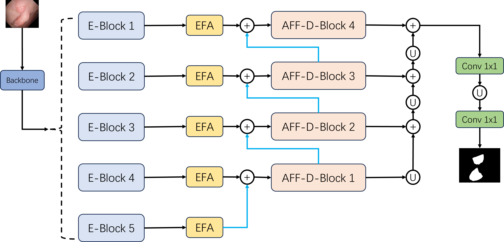
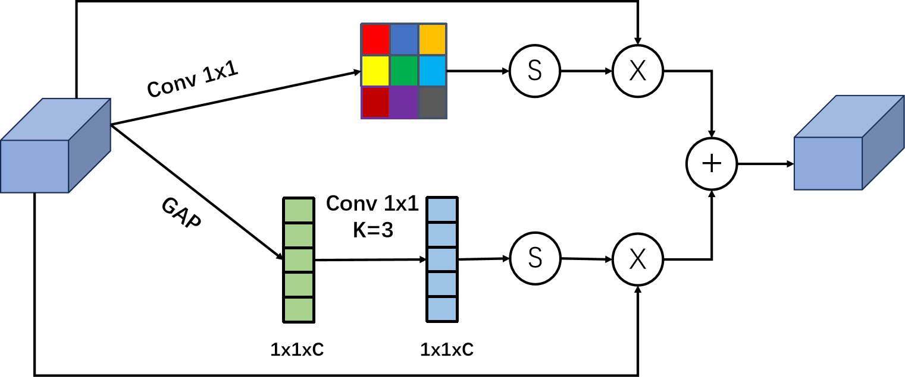
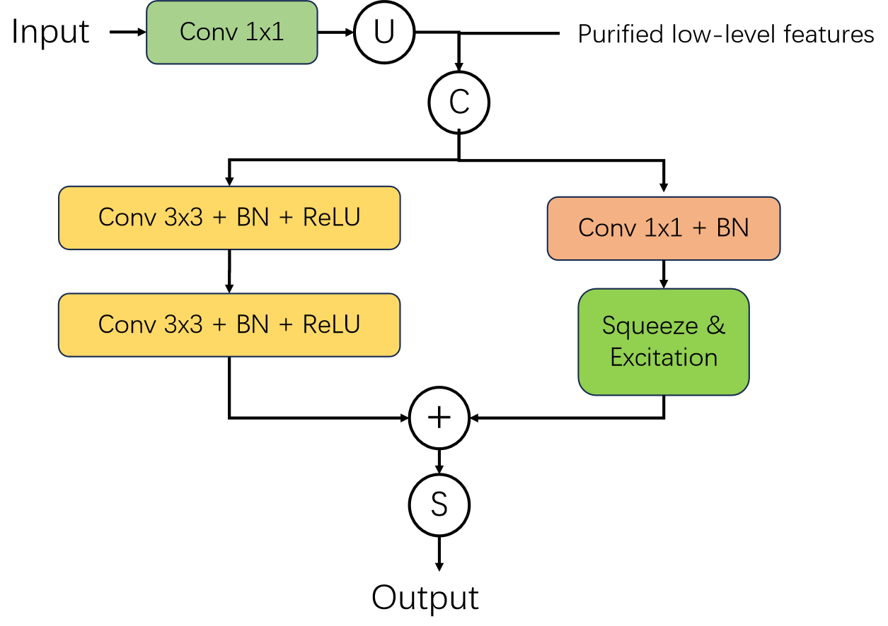
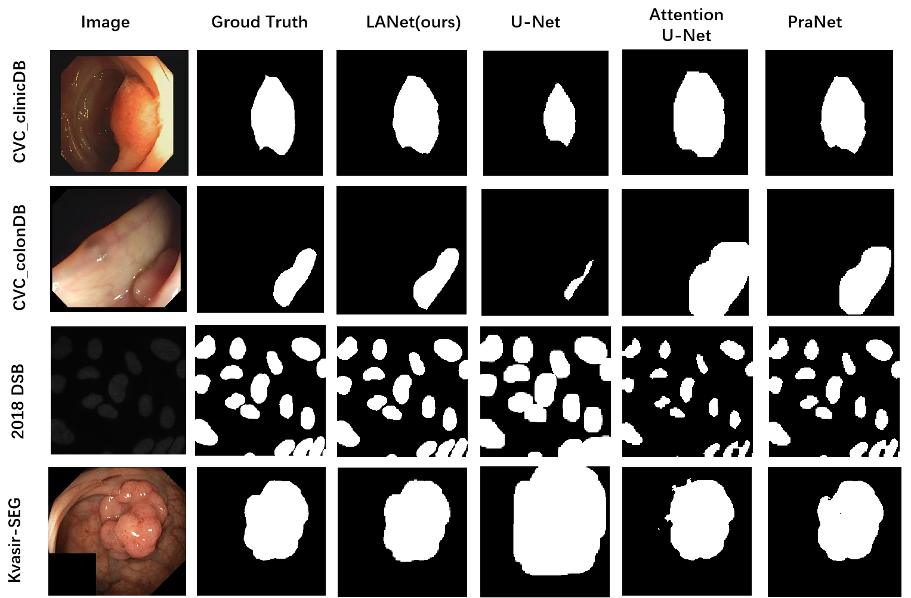
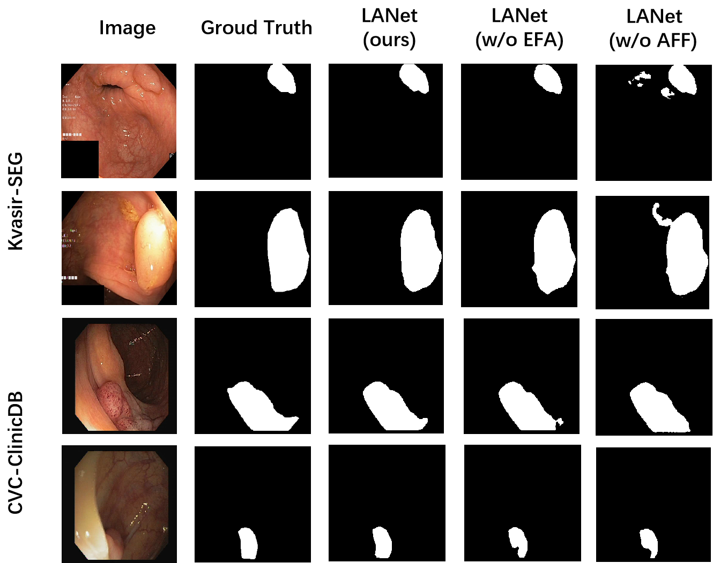

# :sunflower:: LANet: Lightweight Attention Network for Medical Image Segmentation 
**This is the official implementation for article "LANet: Lightweight Attention Network for Medical Image Segmentation". 
The article is submitted in Springer proceedings of the ITTA-2024 conference (https://itta.cyber.az).**

## Overview
**LANet, a Lightweight Attention Network, are presented in the paper and incorporates an Efficient Fusion Attention (EFA) block and an Adaptive Feature Fusion (AFF) decoding block. The model adopts MobileViT as a lightweight backbone network with a small number of parameters, facilitating easy training and faster predictive inference.**

### EFA 
**The EFA block enhances the model's feature extraction capability by capturing task-relevant information while reducing redundancy in channel and spatial locations.**

### AFF
**The AFF decoding block fuses the purified low-level features from the encoder with the sampled features from the decoder, enhancing the network's understanding and expression of input features.**

## 	:pencil: Requirements
* torch == 2.1.1+cu121
* tensorboard == 2.11.2
* numpy == 1.24.1
* python == 3.9.18
* torchvision == 0.16.1+cu121
* ...

## 	 :bar_chart: Datasets
The efficiency of LANet was evaluated using four public datasets: kvasir-SEG, CVC-clinicDB, CVC-colonDB, and the Data Science Bowl 2018. 
All datasets used in paper are public, you can download online.

Split the datasets for train, validation and test with ratio **8:1:1**

##   :chart_with_upwards_trend: Results
### Quantitative results
| Dataset  | mDC | mIoU | mRec | mPrec |
| ------------- | ------------- | ------------- | ------------- | ------------- |
| Kvasir-SEG  | 0.911  | 	0.851  | 	0.903	  | 0.949  |
| CVC_clinicDB  | 0.944 | 0.896  | 0.926  | 0.966  |
| CVC_ColonDB  | 0.771	| 0.712  | 0.758  | 0.894   |
| 2018 DSB  | 0.930	 | 0.871 | 0.918  | 0.946   |

### Qualitative results

### Ablation study

## :black_nib: For citation
waiting...

:exclamation: :eyes: **The codes can not be used for commercial purposes!!!**

